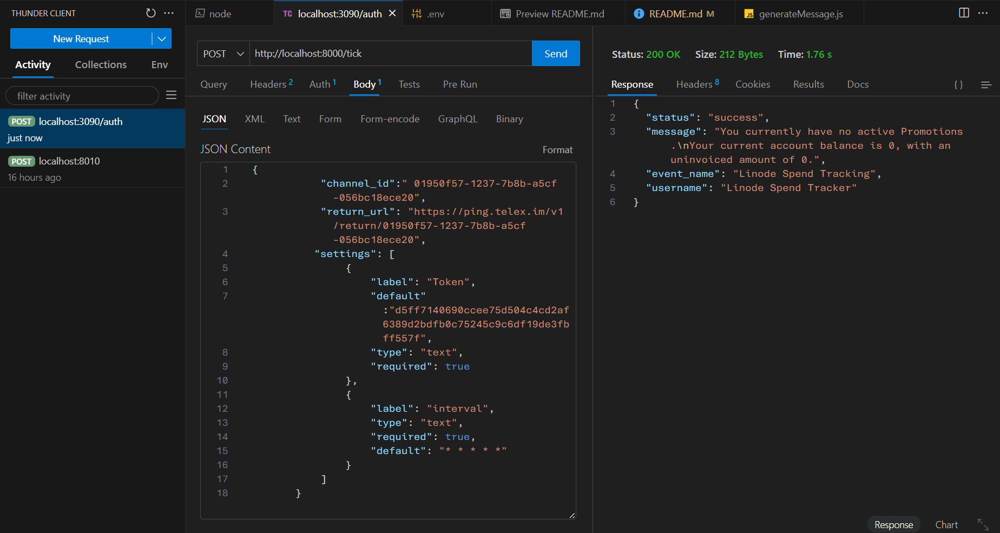
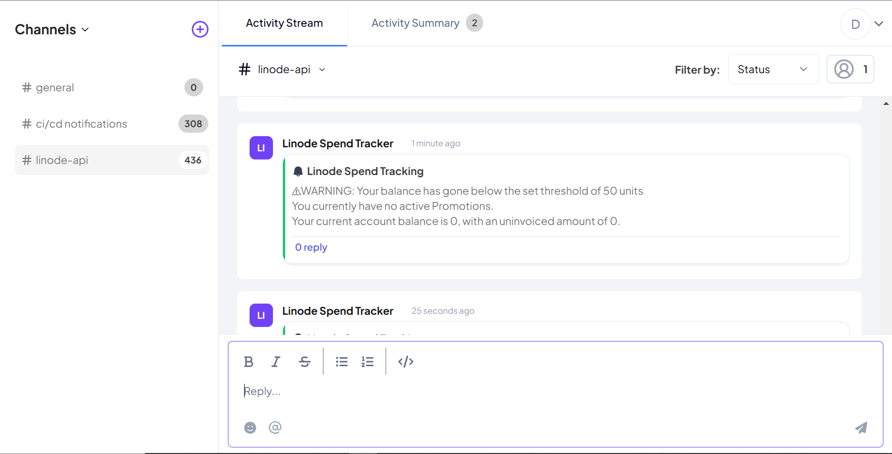
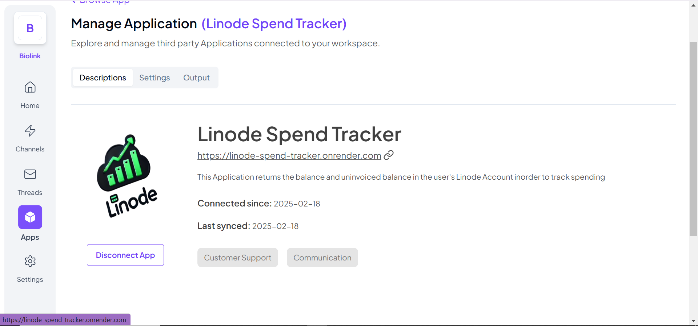

# A Node.js API To Serve as an Interval Integration for the Telex Application

## Overview
An Express.js API that is called by the Telex Application at set intervals and returns a response upon request.

This Node.js API logs the following details:
- The current balance in your Linode account.
- The uninvoiced balance in your Linode account.
- Any active promotions in your account (if available).
- An optional warning when you exceed your spending threshold, sent to a designated Telex channel.

## Features
- Uses an API key to access your Linode account.
- Reads account information from your Linode account.
- Formats account details into a message and sends it to a Telex channel.

## Usage Guide
### Prerequisites
Before cloning this repository, ensure you have the following:
- `node` installed on your local machine.
- A Telex account with an active organization.
- A Linode account.
- A Linode API key with **read-only** permissions.

### Installation Steps
1. Clone the repository:
   ```sh
   git clone https://github.com/telexintegrations/linode-spend-tracker.git
   ```
2. Move into the project folder:
   ```sh
   cd linode-spend-tracker
   ```
3. Install dependencies:
   ```sh
   npm install
   ```
4. Install `nodemon` globally:
   ```sh
   npm install -g nodemon
   ```
5. Start the server:
   ```sh
   nodemon server.js
   ```

---

## API Endpoints
### `GET /integration-specs`
Returns integration metadata and settings.

#### **Request Format**
No request body is needed. 👍

#### **Response Format**
**Success 200 OK ✅**
```json
{
    "data": {
        "date": {
            "created_at": "date_created",
            "updated_at": "date_updated"
        },
        "descriptions": {
            "app_description": "Short description of the app",
            "app_logo": "URL to the logo",
            "app_name": "Name of the application",
            "app_url": "Application domain URL",
            "background_color": "#fff"
        },
        "integration_category": "Category",
        "integration_type": "interval",
        "is_active": true,
        "settings": [
            {
                "label": "Token",
                "type": "text",
                "required": true,
                "default": ""
            },
            {
                "label": "interval",
                "type": "text",
                "required": true,
                "default": "* * * * *"
            },
            {
                "label": "Spending Threshold",
                "type": "number",
                "required": false,
                "default": 0
            }
        ],
        "key_features": [
            "Retrieves real-time balance details from a Linode account.",
            "Notifies users when their account balance exceeds a specified spending threshold.",
            "Formats and sends Linode spending details as messages to a specified Telex channel.",
            "Accepts user-defined settings, including API tokens and threshold values."
        ],
        "permissions": [
            "Retrieves real-time balance details from a Linode account.",
            "Notifies users when their account balance exceeds a specified spending threshold.",
            "Formats and sends Linode spending details as messages to a specified Telex channel.",
            "Accepts user-defined settings, including API tokens and threshold values."
        ],
        "tick_url": "URL that Telex will call",
        "target_url": ""
    }
}
```

---

### `POST /tick`
#### **Request Format**
Telex sends a request in the following format:
```json
```json
{
  "channel_id": "<your-telex-channel-id>",
  "return_url": "https://ping.telex.im/v1/return/<your-channel-id>",
  "settings": [
    { "label": "Token", "type": "text", "required": true },
    { "label": "Spending Threshold", "type": "number", "default": 0 }
  ]
}
```

#### **Response Format**
##### Success 200 ✅
```json
{
  "status": "success",
  "message": "short message gotten from the API",
  "event_name": "Linode Spend Tracking",
  "username": "Linode Spend Tracker"
}
```
##### Bad Gateway 😟
```json
{
    "status": "error", 
    "message": "Could not send message to Channel. Maybe wrong channel ID"
}
```
##### Unauthorized 401 🔒
```json
{
    "status": "error", "message": "Linode API keys is wrong"
}
```

## Example Usage
### Using `cURL`
To test the integration using `cURL`, use the following command to trigger the `/tick` endpoint
```
curl -X POST "http://localhost:8000/tick" \
    -d '  {
            "channel_id":" 01950f57-1237-7b8b-a5cf-056bc18ece20",
            "return_url": "https://ping.telex.im/v1/return/01950f57-1237-7b8b-a5cf-056bc18ece20",
           "settings": [
                {
                    "label": "Token",
                    "default":"d5ff7140690ccee75d504c4cd2af6389d2bdfb0c75245c9c6df19de3fbff557f",
                    "type": "text",
                    "required": true
                },
                {
                    "label": "interval",
                    "type": "text",
                    "required": true,
                    "default": "* * * * *"
                }
            ]
        }
    '
```
This will return to you a JSON response, containing a message about your linode account.

### Using API Testers such as POSTman or ThunderClient
To test the integration with postman, perform a `POST` request to the following endpoint `http://localhost:8000/tick` with the following payload
```json 
{
    "channel_id":" 01950f57-1237-7b8b-a5cf-056bc18ece20",
    "return_url": "https://ping.telex.im/v1/return/01950f57-1237-7b8b-a5cf-056bc18ece20",
    "settings": [
        {
            "label": "Token",
            "default":"d5ff7140690ccee75d504c4cd2af6389d2bdfb0c75245c9c6df19de3fbff557f",
            "type": "text",
            "required": true
        },
        {
            "label": "Spending Threshold", 
            "default": 0, 
            "type": "number", 
            "required": false
        }
        {
            "label": "interval",
            "type": "text",
            "required": true,
            "default": "* * * * *"
        }
    ]
}
```
#### Screenshots


### Using The Integration on Telex
Using the integration on telex is very straightfoward, go to settings⚙ and:
1. Set the API token of your linode account. 
2. Set your own interval of choice
3. Though optional, you can set a spending threshold that will be included in the message if you passed that threshold.


## 🚀 Deployment  
Hosted on **Render**

### Setting Up Deployment on Render
If you need to deploy this application on **Render**, follow these steps:  

1. Go to **Render Dashboard** and create a **new Web Service**.  
2. Connect the service to your GitHub repository.  
3. In the **Environment Variables** section, add the required variables, including:  
   - `LINODE_TOKEN` → Your Linode API key  
   - `RENDER_API_KEY` → Your Render API key  
   - Any other required environment variables  
4. Set the **Start Command** to:  
   ```sh
   npm start
   ```  
5. Deploy the service, and Render will handle the rest.  

### Continuous Deployment with GitHub Actions 
This project is configured for automatic deployments using **GitHub Actions**. Ensure you add your **Render API Key** to GitHub Secrets to allow the deployment workflow to push updates.  

### **Updating the Deployment**  
Once GitHub Actions is set up, deployments happen automatically when you push changes to the **main** branch.

### Screenshots

<br> <br>


## Contribution
Contributions are welcome! To contribute:
1. Fork the repository.
2. Create a new branch: `git checkout -b feature-branch`
3. Commit your changes: `git commit -m "Add new feature"`
4. Push the branch: `git push origin feature-branch`
5. Open a pull request.